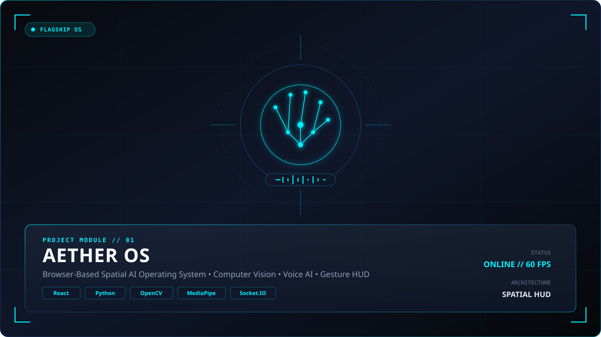
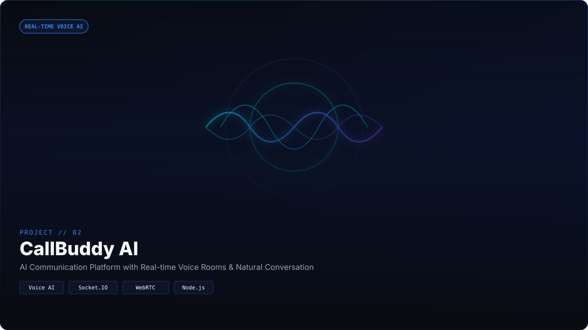
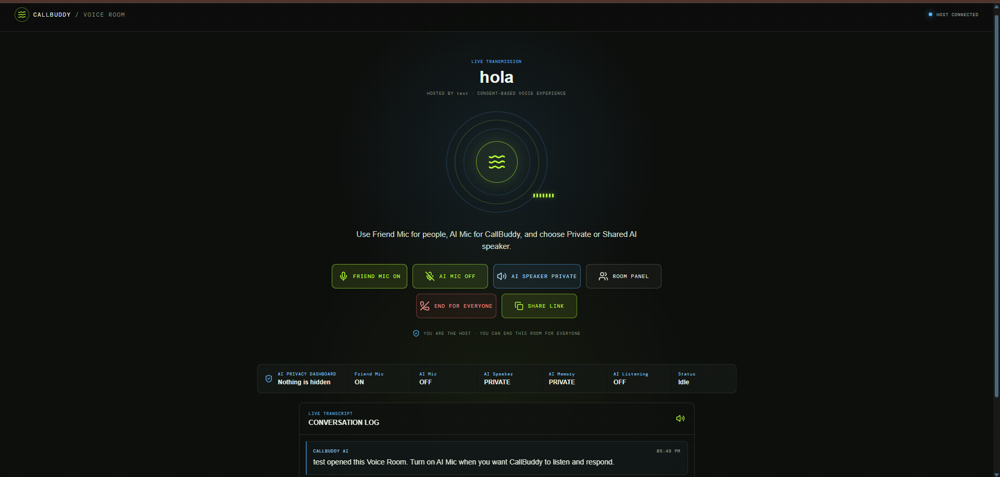
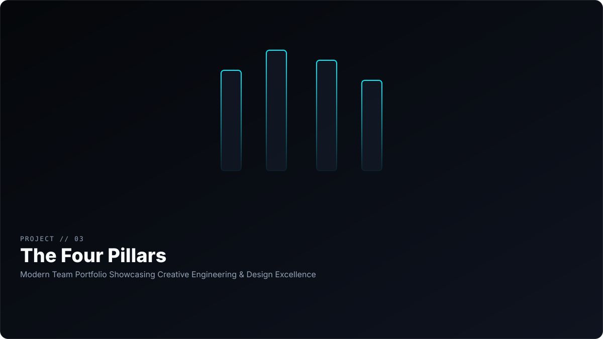
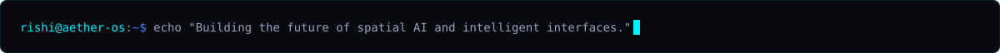

```text
[AETHER-OS v4.2.0] :: INITIALIZING KERNEL...
[SYSTEM] :: LOADING NEURAL RUNTIME... [OK]
[VISION] :: COMPUTER VISION & MEDIAPIPE PIPELINES... [ONLINE]
[VOICE]  :: REAL-TIME AUDIO SIGNAL PROCESSOR... [ONLINE]
[STATUS] :: DEVELOPER PROFILE READY.
```

<div align="center">


<br />


<br />

# **Rishi Shaw**
### **AI Engineer &nbsp;•&nbsp; Full Stack Developer &nbsp;•&nbsp; Computer Vision Developer**

*Engineering spatial AI operating systems where voice, vision, and human interaction unify.*

<br />

<a href="https://git.io/typing-svg"></a>

<br />

<a href="https://github.com/Rishi-Dev-pro"><code><b>[ GITHUB ]</b></code></a>
&nbsp;&nbsp;
<a href="https://www.linkedin.com/in/rishi-shaw-389800389/"><code><b>[ LINKEDIN ]</b></code></a>
&nbsp;&nbsp;
<a href="mailto:rishishaw23022006@gmail.com"><code><b>[ EMAIL DISPATCH ]</b></code></a>

<br /><br />

### `// AETHER OS MODULE DIRECTORY`

<a href="#core-systems"><code><b>[ 01. CORE SYSTEMS ]</b></code></a> &nbsp;
<a href="#current-mission"><code><b>[ 02. CURRENT MISSION ]</b></code></a> &nbsp;
<a href="#evolution"><code><b>[ 03. EVOLUTION ]</b></code></a> &nbsp;
<a href="#tech-stack"><code><b>[ 04. TECH MATRIX ]</b></code></a> &nbsp;
<a href="#activity-metrics"><code><b>[ 05. ACTIVITY ]</b></code></a> &nbsp;
<a href="#contact-dispatch"><code><b>[ 06. CONTACT ]</b></code></a>

</div>

<br />

### `// PROFILE SNAPSHOT`

> **OPERATOR:** Rishi Shaw  
> **PRIMARY DISCIPLINE:** AI Engineering &amp; Computer Vision  
> **ACTIVE CORE:** Building **AETHER OS** (Browser AI OS) &amp; **CallBuddy AI**  
> **DOMAINS:** Spatial Computing • Gesture Recognition HUDs • Real-Time Voice AI  
> **STATUS:** Open to AI Engineering Roles &amp; High-Impact Product Collaborations  

<br />

### `// 01. ENGINEERING PHILOSOPHY & MISSION`

<div align="center">

> *"I enjoy building software that feels alive. My goal isn't simply creating applications. I want to create AI experiences where voice, vision, intelligence, and interaction come together naturally."*

<br />

  
  &nbsp;&nbsp;
  
  &nbsp;&nbsp;
  

</div>

<br />


<br />

<a id="core-systems"></a>
### `// 02. CORE SYSTEMS & COMMUNICATION MODULES`

<br />

<!-- ====================================================
     FLAGSHIP OS MODULE 01: AETHER OS
     ==================================================== -->
<div align="center">



<br /><br />


<br /><br />

## **AETHER OS**
### *AI Operating System for the Browser*

<br />


&nbsp;

&nbsp;


<br /><br />

🟢 **Active Development**

</div>

<br />

#### **Executive Summary**
AETHER OS is a spatial operating system running entirely inside the web browser. It combines real-time computer vision, hand gesture recognition, and voice automation so users can control digital tools hands-free through a futuristic glass HUD interface.

#### **The Problem**
Traditional operating systems force developers and users to rely strictly on physical hardware peripherals. AETHER OS removes physical input friction by enabling natural spatial movement and voice commands directly within browser-native environments.

#### **Key Engineering Highlights**
- **In-Browser Vision Engine:** Real-time hand and face tracking using MediaPipe and OpenCV pipelines.
- **Voice Automation Hub:** Context-aware voice assistant supporting real-time desktop automation commands.
- **Spatial Glass HUD:** 60fps glassmorphic user interface built with React and custom CSS design tokens.
- **Bi-Directional Event Bus:** Socket.IO bridge connecting browser gesture events to backend OS scripts.

#### **Technology Stack**
<div align="left">
  
  
  
  
</div>

<br />

<div align="center">

<a href="https://github.com/Rishi-Dev-pro/AETHER-OS"><code><b>[ View Repository ]</b></code></a>

<br /><br />


</div>

<br />

<!-- ====================================================
     COMMUNICATION MODULE 02: CALLBUDDY AI
     ==================================================== -->
<div align="center">



<br /><br />


&nbsp;


<br /><br />

## **CallBuddy AI**
### *Real-Time AI Voice Communication Platform*

<br />


&nbsp;


<br /><br />

🟢 **Live Production**

</div>

<br />

#### **Executive Summary**
CallBuddy AI is an intelligent communication platform where users can create voice rooms, invite friends, and talk naturally with an AI assistant that listens and responds in real time.

#### **The Problem**
Most AI tools limit human interaction to rigid, asynchronous text chatboxes. CallBuddy AI turns AI interaction into a live, natural voice participant within group audio channels.

#### **Key Engineering Highlights**
- **Low-Latency Voice Stream:** Sub-second speech processing pipeline built on WebRTC and Socket.IO.
- **Multi-User Audio Channels:** Real-time channel routing allowing humans and AI to converse in the same room.
- **Context-Aware Memory:** Persistent conversation retention for natural turn-taking and topic tracking.

#### **Technology Stack**
<div align="left">
  
  
  
</div>

<br />

<div align="center">

<a href="https://github.com/Rishi-Dev-pro/CallBuddy-AI"><code><b>[ View Repository ]</b></code></a>

<br /><br />


</div>

<br />

<!-- ====================================================
     SHOWCASE MODULE 03: THE FOUR PILLARS
     ==================================================== -->
<div align="center">



<br /><br />


<br /><br />

## **The Four Pillars**
### *Modern Team Portfolio & Creative Web Showcase*

<br />


<br /><br />

🚀 **Production Release**

</div>

<br />

#### **Executive Summary**
The Four Pillars is a modern team portfolio website designed to showcase developer collaboration, creative web animation, and high-end frontend craftsmanship.

#### **The Purpose & Problem**
Standard developer portfolios often feel template-driven and static. The Four Pillars solves this by delivering an immersive visual experience that highlights design systems, performance optimization, and engineering synergy.

#### **Key Engineering Highlights**
- **Modular Design Tokens:** Dark glassmorphism panels, HSL color tokens, and custom fluid layouts.
- **High-Performance Rendering:** 60fps interactive web animations optimized for desktop and mobile viewports.

#### **Technology Stack**
<div align="left">
  
  
</div>

<br />

<div align="center">

<a href="https://github.com/Rishi-Dev-pro/The-Four-Pillars"><code><b>[ View Repository ]</b></code></a>
&nbsp;&nbsp;&nbsp;&nbsp;
<a href="https://the-four-pillars.vercel.app/"><code><b>[ View Live Demo ]</b></code></a>

</div>

<br />


<br />

<a id="current-mission"></a>
### `// 03. CURRENT MISSION & STATUS`

<br />

> **SYSTEM STATUS:** ACTIVE BUILD PHASE  
> **CURRENTLY BUILDING:** **AETHER OS** (Computer Vision & Gesture HUD Pipelines)  
> **CURRENTLY SCALING:** **CallBuddy AI** (Low-Latency Voice Rooms & WebRTC Channels)  
> **CURRENT RESEARCH:** Real-Time In-Browser Gesture Physics & Voice Latency Reduction  
> **NEXT MILESTONE:** Launching **Mochi AI Companion v1.0**  

<br />

<div align="center">
  
  &nbsp;&nbsp;
  
  &nbsp;&nbsp;
  
</div>

<br />


<br />

<a id="evolution"></a>
### `// 04. ENGINEERING EVOLUTION`

```text
SYSTEM LOG :: ENGINEERING PROGRESSION
─────────────────────────────────────────────────────────────────────────────

[01] CURIOSITY & FOUNDATIONS
 ├── Mastered Web Technologies, Full Stack Engineering & Software Architecture
 └── Built Campus Resolve (SaaS Problem Reporting Platform)

[02] REAL-TIME VOICE INTELLIGENCE
 ├── Developed CallBuddy AI
 └── Engineered WebRTC Audio Streaming Channels & Multi-User Voice Rooms

[03] SPATIAL BROWSER INTERFACES
 ├── Building AETHER OS
 └── Integrating In-Browser OpenCV & MediaPipe Computer Vision HUDs

[04] HUMAN-CENTERED AI COMPANIONSHIP
 ├── Developing Mochi (AI Developer Pet & Companion)
 └── Combining Conversational AI Memory with Natural Peer Support

[05] FUTURE SPATIAL VISION
 └── Architecting Fluid Systems Where Voice, Vision & Intelligence Unify
```

<br />


<br />

<a id="tech-stack"></a>
### `// 05. TECHNICAL MATRIX & STACK`

<br />

#### **AI & Computer Vision**
<div align="left">
  
  
  
  
</div>

<br />

#### **Frontend & Spatial Interfaces**
<div align="left">
  
  
</div>

<br />

#### **Backend & Real-Time Infrastructure**
<div align="left">
  <code>Node.js</code> &nbsp;•&nbsp;
  <code>Socket.IO</code> &nbsp;•&nbsp;
  <code>WebRTC</code> &nbsp;•&nbsp;
  <code>MongoDB</code> &nbsp;•&nbsp;
  <code>Express</code>
</div>

<br />


<br />

<a id="activity-metrics"></a>
### `// 06. SYSTEM ACTIVITY & METRICS`

<br />

<div align="center">


&nbsp;


</div>

<br />

### `// 07. CONTRIBUTION VISUALIZATION`

<br />

<div align="center">


</div>

<br />


<br />

### `// 08. ENGINEERING MILESTONES`

- **AETHER OS Development:** Architected an AI-powered browser operating system with real-time hand gesture tracking and voice automation.
- **CallBuddy AI Launch:** Built a real-time voice AI communication platform supporting multi-user voice channels.
- **Computer Vision Innovation:** Implemented low-latency OpenCV and MediaPipe vision pipelines directly inside web browsers.
- **Human-AI Companionship (Mochi):** Designing an AI developer companion focused on contextual conversational support.

<br />


<br />

<a id="contact-dispatch"></a>
### `// 09. TERMINAL DISPATCH & CONTACT`

<div align="center">



<br />

### *Let's build intelligent systems together.*

<br />

<a href="https://github.com/Rishi-Dev-pro"><code><b>[ GITHUB PROFILE ]</b></code></a>
&nbsp;&nbsp;&nbsp;&nbsp;
<a href="https://www.linkedin.com/in/rishi-shaw-389800389/"><code><b>[ LINKEDIN NETWORK ]</b></code></a>
&nbsp;&nbsp;&nbsp;&nbsp;
<a href="mailto:rishishaw23022006@gmail.com"><code><b>[ EMAIL DISPATCH ]</b></code></a>

</div>

<br /><br />

> **SYSTEM NOTE:** Always open to exploring hard problems in spatial computing, computer vision, and real-time voice intelligence. Feel free to connect or reach out.

<br />

```text
─────────────────────────────────────────────────────────────────────────────
SYSTEM STATUS: ONLINE // RUNTIME: STABLE // TELEMETRY: ACTIVE
Powered by curiosity, spatial engineering, and continuous learning.
─────────────────────────────────────────────────────────────────────────────
```
