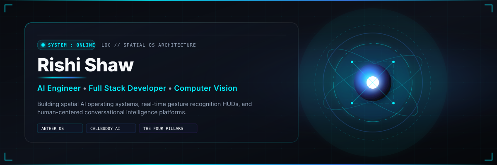
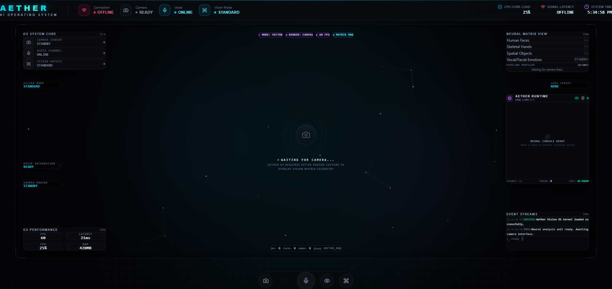
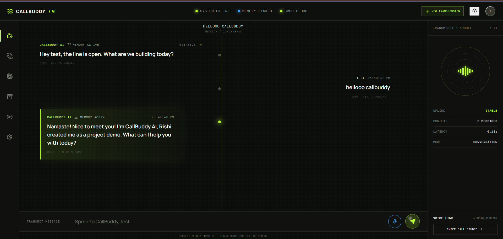
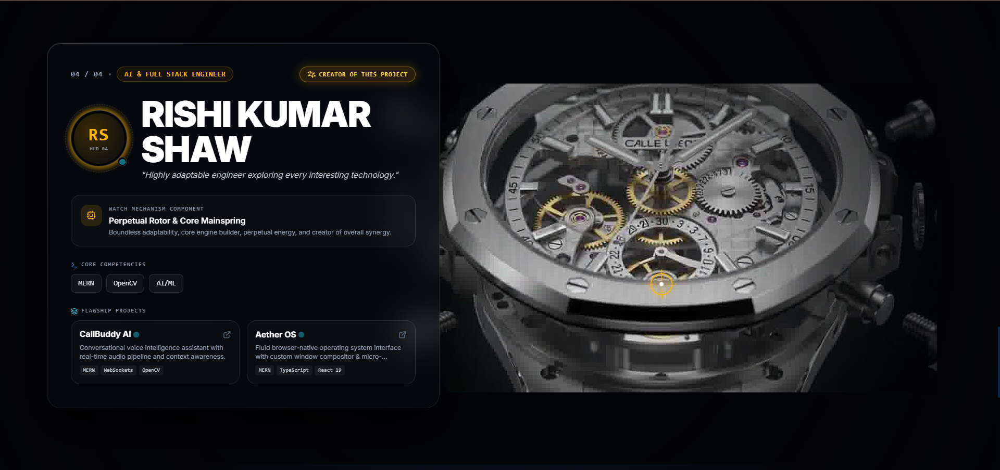
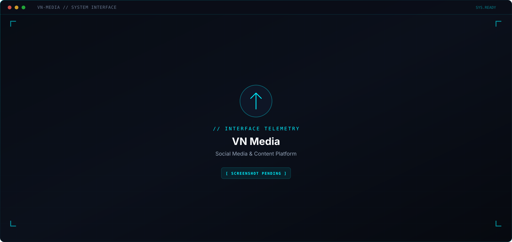
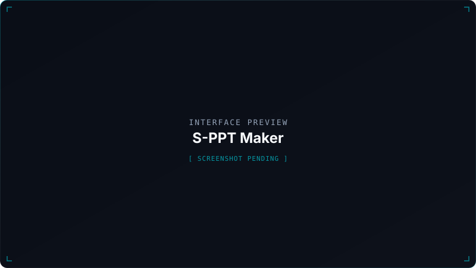
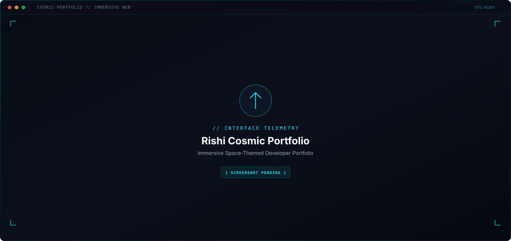
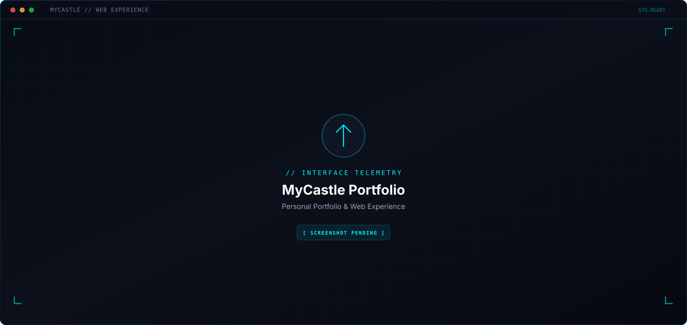
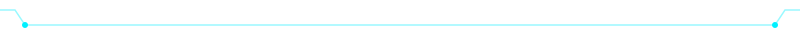

 

 

# **Rishi Shaw**
### **AI Engineer &nbsp;•&nbsp; Full Stack Developer &nbsp;•&nbsp; Computer Vision Developer**

*Engineering spatial AI operating systems where voice, vision, and human interaction unify.*

 

 

<a href="https://github.com/Rishi-Dev-pro"><code><b>[ GITHUB ]</b></code></a>
&nbsp;&nbsp;
<a href="https://www.linkedin.com/in/rishi-shaw-389800389/"><code><b>[ LINKEDIN ]</b></code></a>
&nbsp;&nbsp;
<a href="mailto:rishishaw23022006@gmail.com"><code><b>[ EMAIL DISPATCH ]</b></code></a>

 

 

<!-- ════════════════════════════════════════════════════════════════
     PROJECT SYSTEMS — CONTINUOUS VERTICAL TIMELINE
     ════════════════════════════════════════════════════════════════ -->

<code>SELECTED SYSTEMS • INTERFACES • EXPERIMENTS</code>

  

<!-- ────────────────────────────────────────────────────────────────
     PROJECT 01 — AETHER OS (Image LEFT, Node CENTER, Desc RIGHT)
     ──────────────────────────────────────────────────────────────── -->

  
  
  
  <code>// 01. SPATIAL AI OS</code>
  <h3><a href="https://github.com/Rishi-Dev-pro/AETHER-OS">AETHER OS</a></h3>
  <em>Spatial Browser AI Operating System</em>
  

    Hands-free spatial glass HUD inside the web browser, unifying computer vision, hand gesture recognition, and voice automation into one cohesive AI operating system.
  

  <code>React</code> <code>TypeScript</code> <code>Python</code> <code>OpenCV</code> <code>MediaPipe</code>
    
  <a href="https://github.com/Rishi-Dev-pro/AETHER-OS"><code><b>[ REPOSITORY ]</b></code></a>

 

  

<!-- ────────────────────────────────────────────────────────────────
     PROJECT 02 — CALLBUDDY AI (Desc LEFT, Node CENTER, Image RIGHT)
     ──────────────────────────────────────────────────────────────── -->

  
  
  
  

    <code>// 02. REAL-TIME VOICE AI</code>
    <h3><a href="https://github.com/Rishi-Dev-pro/CallBuddy-AI">CallBuddy AI</a></h3>
    <em>Real-Time AI Voice Communication Platform</em>
    

      Active AI participation in live multi-user voice rooms with real-time speech processing, WebRTC low-latency audio pipelines, and natural turn-taking.
    

    <code>React</code> <code>TypeScript</code> <code>Python</code> <code>Socket.IO</code> <code>WebRTC</code>
      
    <a href="https://github.com/Rishi-Dev-pro/CallBuddy-AI"><code><b>[ REPOSITORY ]</b></code></a>
  

 

  

<!-- ────────────────────────────────────────────────────────────────
     PROJECT 03 — THE FOUR PILLARS (Image LEFT, Node CENTER, Desc RIGHT)
     ──────────────────────────────────────────────────────────────── -->

  
  
  
  <code>// 03. CREATIVE ENGINEERING</code>
  <h3><a href="https://github.com/Rishi-Dev-pro/The-Four-Pillars">The Four Pillars</a></h3>
  <em>High-Performance Creative Web Showcase</em>
  

    Immersive showcase platform demonstrating 60fps web animations, custom design token architectures, fluid glassmorphism, and responsive frontend systems.
  

  <code>React</code> <code>TypeScript</code> <code>Vite</code> <code>TailwindCSS</code>
    
  <a href="https://github.com/Rishi-Dev-pro/The-Four-Pillars"><code><b>[ REPOSITORY ]</b></code></a>
  &nbsp;
  <a href="https://the-four-pillars.vercel.app/"><code><b>[ LIVE DEMO ]</b></code></a>

 

  

<!-- ────────────────────────────────────────────────────────────────
     PROJECT 04 — VN MEDIA (Desc LEFT, Node CENTER, Image RIGHT)
     ──────────────────────────────────────────────────────────────── -->

  
  
  
  

    <code>// 04. SOCIAL ARCHITECTURE</code>
    <h3><a href="https://github.com/Rishi-Dev-pro/VN-media">VN Media</a></h3>
    <em>Social Media &amp; Content Platform</em>
    

      Full-stack social media application enabling real-time content feeds, user interactions, authenticated profiles, and interactive media distribution.
    

    <code>JavaScript</code> <code>Node.js</code> <code>Express</code> <code>MongoDB</code>
      
    <a href="https://github.com/Rishi-Dev-pro/VN-media"><code><b>[ REPOSITORY ]</b></code></a>
  

 

  

<!-- ────────────────────────────────────────────────────────────────
     PROJECT 05 — S-PPT MAKER (Image LEFT, Node CENTER, Desc RIGHT)
     ──────────────────────────────────────────────────────────────── -->

  
  
  
  <code>// 05. INTELLIGENT TOOLS</code>
  <h3><a href="https://github.com/Rishi-Dev-pro/S-PPT-maker">S-PPT Maker</a></h3>
  <em>AI-Powered Presentation Generator</em>
  

    Automated presentation creation system streamlining slide composition, structured content templates, and seamless web export workflows.
  

  <code>JavaScript</code> <code>React</code> <code>Node.js</code> <code>HTML5</code>
    
  <a href="https://github.com/Rishi-Dev-pro/S-PPT-maker"><code><b>[ REPOSITORY ]</b></code></a>

 

  

<!-- ────────────────────────────────────────────────────────────────
     PROJECT 06 — RISHI COSMIC PORTFOLIO (Desc LEFT, Node CENTER, Image RIGHT)
     ──────────────────────────────────────────────────────────────── -->

  
  
  
  

    <code>// 06. IMMERSIVE EXPERIENCES</code>
    <h3><a href="https://github.com/Rishi-Dev-pro/rishi-cosmic-portfolio">Rishi Cosmic Portfolio</a></h3>
    <em>Immersive Space-Themed Developer Portfolio</em>
    

      Space-themed personal showcase built with TypeScript, featuring smooth interactive transitions, responsive layouts, and modern frontend aesthetics.
    

    <code>TypeScript</code> <code>React</code> <code>CSS3</code>
      
    <a href="https://github.com/Rishi-Dev-pro/rishi-cosmic-portfolio"><code><b>[ REPOSITORY ]</b></code></a>
  

 

  

<!-- ────────────────────────────────────────────────────────────────
     PROJECT 07 — MYCASTLE PORTFOLIO (Image LEFT, Node CENTER, Desc RIGHT)
     ──────────────────────────────────────────────────────────────── -->

  
  
  
  <code>// 07. INTERACTIVE WEB</code>
  <h3><a href="https://github.com/Rishi-Dev-pro/myCastle">MyCastle Portfolio</a></h3>
  <em>Personal Portfolio &amp; Web Experience</em>
  

    Custom web experience highlighting responsive frontend engineering, interactive components, and clean architectural design.
  

  <code>JavaScript</code> <code>HTML5</code> <code>CSS3</code>
    
  <a href="https://github.com/Rishi-Dev-pro/myCastle"><code><b>[ REPOSITORY ]</b></code></a>

 

  

 

 

<!-- ════════════════════════════════════════════════════════════════
     ENGINEERING TELEMETRY
     ════════════════════════════════════════════════════════════════ -->

  

&nbsp;

  

  

  

 

<code>SYS.TERMINATE // RISHI SHAW — AI ENGINEER — ALL SYSTEMS NOMINAL</code>

