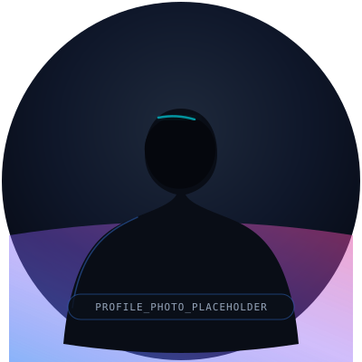
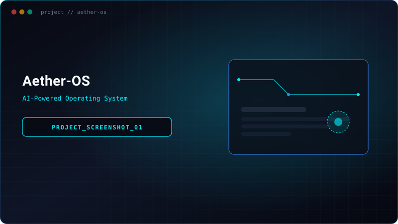
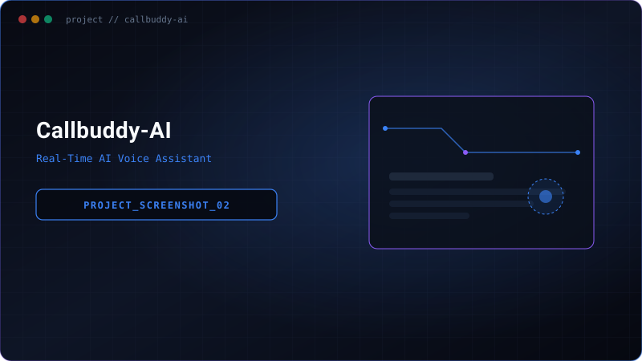
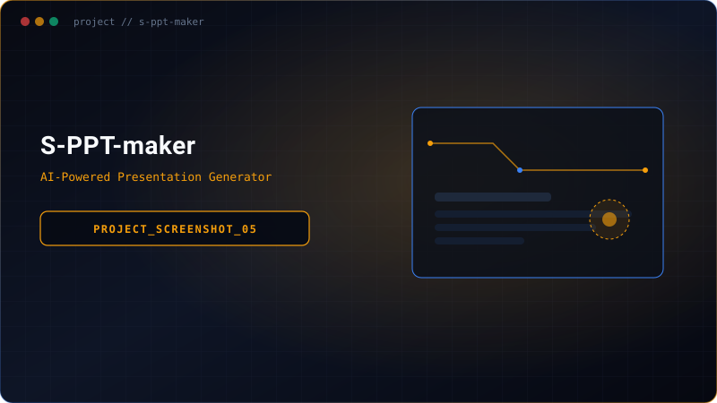
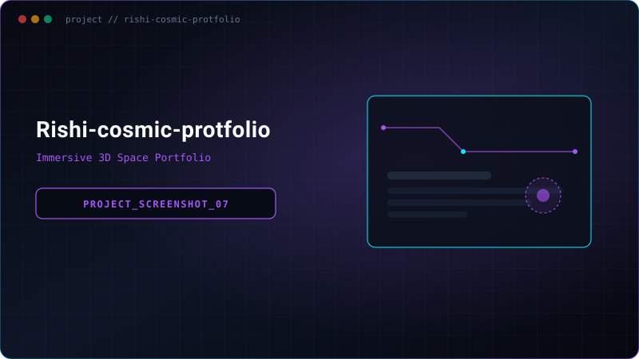
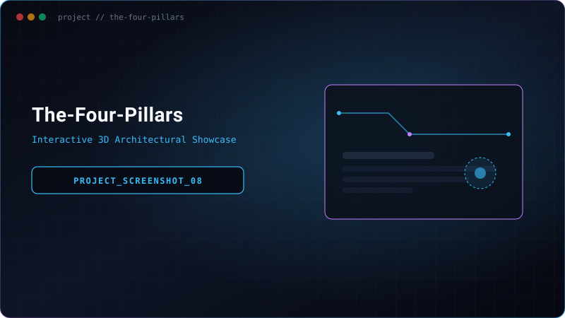
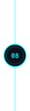

<!-- ════════════════════════════════════════════════════════════════
     1. TOP NAVIGATION / TERMINAL BAR
     ════════════════════════════════════════════════════════════════ -->

<code><b>Rishi@github:~$</b></code>
&nbsp;&nbsp;&nbsp;&nbsp;
<a href="#about"><code><b>[ About ]</b></code></a>
&nbsp;&nbsp;
<a href="#projects"><code><b>[ Projects ]</b></code></a>
&nbsp;&nbsp;
<a href="#tech-stack"><code><b>[ Tech Stack ]</b></code></a>
&nbsp;&nbsp;
<a href="#stats"><code><b>[ Stats ]</b></code></a>
&nbsp;&nbsp;
<a href="#contact"><code><b>[ Contact ]</b></code></a>
&nbsp;&nbsp;&nbsp;&nbsp;
<a href="mailto:rishishaw23022006@gmail.com"><code><b>[ ✈ Let's Connect ]</b></code></a>

  

<!-- ════════════════════════════════════════════════════════════════
     2. HERO SECTION
     ════════════════════════════════════════════════════════════════ -->

  

<code>🟢 Available for opportunities</code>

  

# **Hi, I'm Rishi Shaw**
### **AI Engineer &nbsp;•&nbsp; Full Stack Developer &nbsp;•&nbsp; Computer Vision Developer**

  Building useful AI products, scalable web applications, and computer vision solutions. 
  I enjoy turning ideas into real-world systems that create impact.

  <a href="#projects"><code><b>[ View My Work ]</b></code></a>
  &nbsp;&nbsp;&nbsp;&nbsp;
  <a href="mailto:rishishaw23022006@gmail.com"><code><b>[ Contact Me ]</b></code></a>

 

<blockquote>
  <h3><i>“Engineering is not just about writing code, it's about solving real problems.”</i></h3>
  — Rishi Shaw
</blockquote>

 

  <code><b>🚀 8+ Projects</b></code>
  &nbsp;&nbsp;&nbsp;&nbsp;•&nbsp;&nbsp;&nbsp;&nbsp;
  <code><b>🌐 3+ Tech Domains</b></code>
  &nbsp;&nbsp;&nbsp;&nbsp;•&nbsp;&nbsp;&nbsp;&nbsp;
  <code><b>💡 ∞ Learning</b></code>

  

<!-- ════════════════════════════════════════════════════════════════
     3. ABOUT ME SECTION
     ════════════════════════════════════════════════════════════════ -->

  
  <h2>👤 About Me</h2>
  

    I am a Computer Science enthusiast passionate about Artificial Intelligence, Computer Vision, and Full Stack Development. I love exploring new technologies, building projects, and continuously learning. My goal is to create intelligent systems that are practical, scalable, and impactful.
  

  

    <code>📍 India</code> &nbsp;&nbsp;&nbsp;
    <code>🎓 B.Tech (CSE)</code> &nbsp;&nbsp;&nbsp;
    <code>💻 Always learning</code> &nbsp;&nbsp;&nbsp;
    <code>🤝 Open to collaboration</code>
  

 
 

<!-- ════════════════════════════════════════════════════════════════
     4. TECH STACK SECTION
     ════════════════════════════════════════════════════════════════ -->

<h2>⚡ Tech Stack</h2>
<code>LANGUAGES • FRAMEWORKS • TOOLS &amp; ARCHITECTURE</code>

  

&nbsp;
&nbsp;
&nbsp;
&nbsp;

  

&nbsp;
&nbsp;
&nbsp;
&nbsp;

  

<a href="https://github.com/Rishi-Dev-pro"><b>View All Skills →</b></a>

  

<!-- ════════════════════════════════════════════════════════════════
     5. PROJECTS JOURNEY (CENTRAL ALTERNATING TIMELINE)
     ════════════════════════════════════════════════════════════════ -->

<code>// MY WORK</code>

<h1>Projects Journey</h1>

<i>A collection of projects that reflect my learning, skills and passion.</i>

  

<!-- ────────────────────────────────────────────────────────────
     01 — Aether-OS (Screenshot LEFT | Node CENTER | Desc RIGHT)
     ──────────────────────────────────────────────────────────── -->

  
  
  <code>// 01. AI OPERATING SYSTEM</code>
  <h3><a href="https://github.com/Rishi-Dev-pro/AETHER-OS">Aether-OS</a></h3>
  <em>AI-Powered Operating System</em>
  

    Natural language interface for file management, app control, and automation. A futuristic OS that brings AI into everyday computing.
  

  <code>React</code> <code>TypeScript</code> <code>Python</code> <code>OpenCV</code>
    
  <a href="https://github.com/Rishi-Dev-pro/AETHER-OS"><code><b>[ Live Demo ↗ ]</b></code></a> &nbsp;
  <a href="https://github.com/Rishi-Dev-pro/AETHER-OS"><code><b>[ GitHub ↗ ]</b></code></a>

 
  

<!-- ────────────────────────────────────────────────────────────
     02 — Callbuddy-AI (Desc LEFT | Node CENTER | Screenshot RIGHT)
     ──────────────────────────────────────────────────────────── -->

  
  
  

    <code>// 02. REAL-TIME VOICE AI</code>
    <h3><a href="https://github.com/Rishi-Dev-pro/CallBuddy-AI">Callbuddy-AI</a></h3>
    <em>Real-Time AI Voice Assistant</em>
    

      Live voice communication platform with real-time transcription, AI responses and natural conversation.
    

    <code>React</code> <code>Socket.IO</code> <code>WebRTC</code> <code>Python</code>
      
    <a href="https://github.com/Rishi-Dev-pro/CallBuddy-AI"><code><b>[ Live Demo ↗ ]</b></code></a> &nbsp;
    <a href="https://github.com/Rishi-Dev-pro/CallBuddy-AI"><code><b>[ GitHub ↗ ]</b></code></a>
  

 
  

<!-- ────────────────────────────────────────────────────────────
     03 — Mochi (Screenshot LEFT | Node CENTER | Desc RIGHT)
     ──────────────────────────────────────────────────────────── -->

  
  
  <code>// 03. COMPANION INTELLIGENCE</code>
  <h3><a href="https://github.com/Rishi-Dev-pro">Mochi</a></h3>
  <em>AI Companion &amp; Smart Assistant</em>
  

    Sleek futuristic AI robot companion featuring autonomous ambient interaction, contextual intelligence, and real-time voice and vision synthesis.
  

  <code>Python</code> <code>PyTorch</code> <code>React</code> <code>FastAPI</code>
    
  <a href="https://github.com/Rishi-Dev-pro"><code><b>[ Live Demo ↗ ]</b></code></a> &nbsp;
  <a href="https://github.com/Rishi-Dev-pro"><code><b>[ GitHub ↗ ]</b></code></a>

 
  

<!-- ────────────────────────────────────────────────────────────
     04 — VN-media (Desc LEFT | Node CENTER | Screenshot RIGHT)
     ──────────────────────────────────────────────────────────── -->

  
  
  

    <code>// 04. SOCIAL ARCHITECTURE</code>
    <h3><a href="https://github.com/Rishi-Dev-pro/VN-media">VN-media</a></h3>
    <em>Social Media &amp; Content Platform</em>
    

      A full-stack social media platform with real-time features, content feeds, user profiles and interactive media distribution.
    

    <code>JavaScript</code> <code>Node.js</code> <code>Express</code> <code>MongoDB</code>
      
    <a href="https://github.com/Rishi-Dev-pro/VN-media"><code><b>[ Live Demo ↗ ]</b></code></a> &nbsp;
    <a href="https://github.com/Rishi-Dev-pro/VN-media"><code><b>[ GitHub ↗ ]</b></code></a>
  

 
  

<!-- ────────────────────────────────────────────────────────────
     05 — S-PPT-maker (Screenshot LEFT | Node CENTER | Desc RIGHT)
     ──────────────────────────────────────────────────────────── -->

  
  
  <code>// 05. INTELLIGENT TOOLS</code>
  <h3><a href="https://github.com/Rishi-Dev-pro/S-PPT-maker">S-PPT-maker</a></h3>
  <em>AI-Powered Presentation Generator</em>
  

    Automated presentation creation system streamlining slide composition, structured content templates, and seamless web export workflows.
  

  <code>JavaScript</code> <code>React</code> <code>Node.js</code> <code>HTML5</code>
    
  <a href="https://github.com/Rishi-Dev-pro/S-PPT-maker"><code><b>[ Live Demo ↗ ]</b></code></a> &nbsp;
  <a href="https://github.com/Rishi-Dev-pro/S-PPT-maker"><code><b>[ GitHub ↗ ]</b></code></a>

 
  

<!-- ────────────────────────────────────────────────────────────
     06 — pirate-civ (Desc LEFT | Node CENTER | Screenshot RIGHT)
     ──────────────────────────────────────────────────────────── -->

  
  
  

    <code>// 06. PROCEDURAL SIMULATION</code>
    <h3><a href="https://github.com/Rishi-Dev-pro">pirate-civ</a></h3>
    <em>Procedural Strategy &amp; Simulation Game</em>
    

      Interactive civilization and naval strategy simulation game with procedural generation, resource economies, and immersive canvas rendering.
    

    <code>JavaScript</code> <code>Canvas API</code> <code>WebAudio</code> <code>Vite</code>
      
    <a href="https://github.com/Rishi-Dev-pro"><code><b>[ Live Demo ↗ ]</b></code></a> &nbsp;
    <a href="https://github.com/Rishi-Dev-pro"><code><b>[ GitHub ↗ ]</b></code></a>
  

 
  

<!-- ────────────────────────────────────────────────────────────
     07 — Rishi-cosmic-protfolio (Screenshot LEFT | Node CENTER | Desc RIGHT)
     ──────────────────────────────────────────────────────────── -->

  
  
  <code>// 07. IMMERSIVE EXPERIENCES</code>
  <h3><a href="https://github.com/Rishi-Dev-pro/rishi-cosmic-portfolio">Rishi-cosmic-protfolio</a></h3>
  <em>Immersive 3D Space Portfolio</em>
  

    Space-themed personal showcase built with interactive 3D particle shaders, smooth scroll choreography, and celestial visual effects.
  

  <code>TypeScript</code> <code>Three.js</code> <code>React</code> <code>GSAP</code>
    
  <a href="https://github.com/Rishi-Dev-pro/rishi-cosmic-portfolio"><code><b>[ Live Demo ↗ ]</b></code></a> &nbsp;
  <a href="https://github.com/Rishi-Dev-pro/rishi-cosmic-portfolio"><code><b>[ GitHub ↗ ]</b></code></a>

 
  

<!-- ────────────────────────────────────────────────────────────
     08 — The-Four-Pillars (Desc LEFT | Node CENTER | Screenshot RIGHT)
     ──────────────────────────────────────────────────────────── -->

  
  
  

    <code>// 08. CREATIVE ENGINEERING</code>
    <h3><a href="https://github.com/Rishi-Dev-pro/The-Four-Pillars">The-Four-Pillars</a></h3>
    <em>Interactive 3D Showcase</em>
    

      High-performance creative web showcase with 3D animations, custom design tokens, fluid glassmorphism, and smooth responsive UI.
    

    <code>React</code> <code>Three.js</code> <code>Vite</code> <code>TailwindCSS</code>
      
    <a href="https://the-four-pillars.vercel.app/"><code><b>[ Live Demo ↗ ]</b></code></a> &nbsp;
    <a href="https://github.com/Rishi-Dev-pro/The-Four-Pillars"><code><b>[ GitHub ↗ ]</b></code></a>
  

 
  

<!-- ════════════════════════════════════════════════════════════════
     6. GITHUB STATS SECTION
     ════════════════════════════════════════════════════════════════ -->

<h2>📊 Engineering Telemetry</h2>
 

  <code><b>📦 Total Repositories: 20+</b></code>
  &nbsp;&nbsp;&nbsp;&nbsp;
  <code><b>⭐ Total Stars: 50+</b></code>
  &nbsp;&nbsp;&nbsp;&nbsp;
  <code><b>🔄 Total Commits: 500+</b></code>
  &nbsp;&nbsp;&nbsp;&nbsp;
  <code><b>🔥 Current Streak: 30+ days</b></code>

 

&nbsp;

  

<!-- ════════════════════════════════════════════════════════════════
     7. FOOTER SECTION
     ════════════════════════════════════════════════════════════════ -->

 

<h3><i>“A better tomorrow is built by what we do today.”</i></h3>
— Rishi Shaw

  

<a href="https://github.com/Rishi-Dev-pro"><code><b>[ GITHUB ]</b></code></a>
&nbsp;&nbsp;&nbsp;&nbsp;
<a href="https://www.linkedin.com/in/rishi-shaw-389800389/"><code><b>[ LINKEDIN ]</b></code></a>
&nbsp;&nbsp;&nbsp;&nbsp;
<a href="mailto:rishishaw23022006@gmail.com"><code><b>[ EMAIL ]</b></code></a>
&nbsp;&nbsp;&nbsp;&nbsp;
<a href="https://instagram.com"><code><b>[ INSTAGRAM ]</b></code></a>

  

<code>SYS.TERMINATE // RISHI SHAW — AI ENGINEER — ALL SYSTEMS NOMINAL</code>

