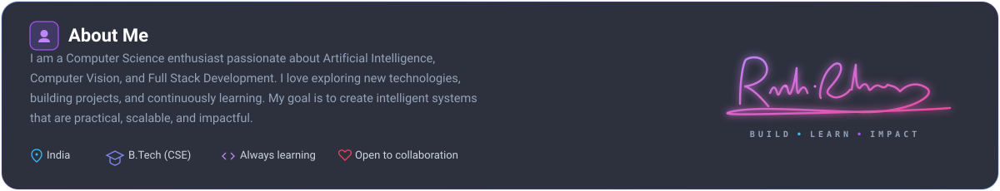
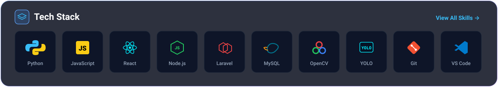
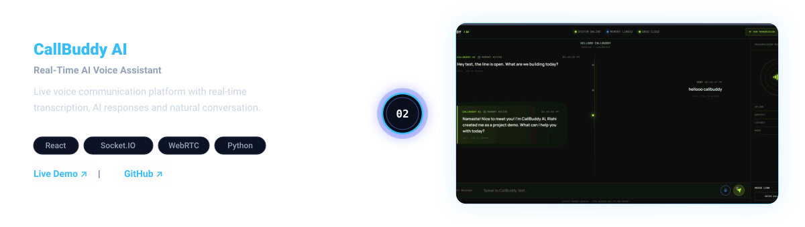
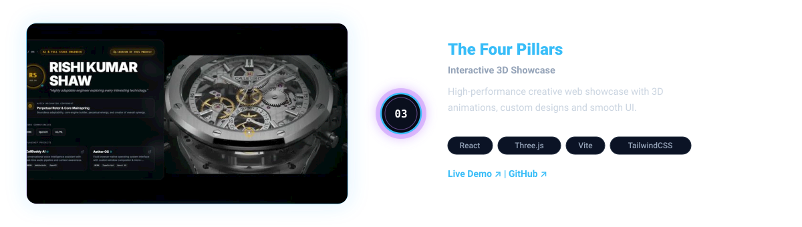
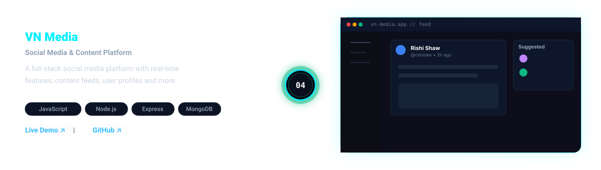
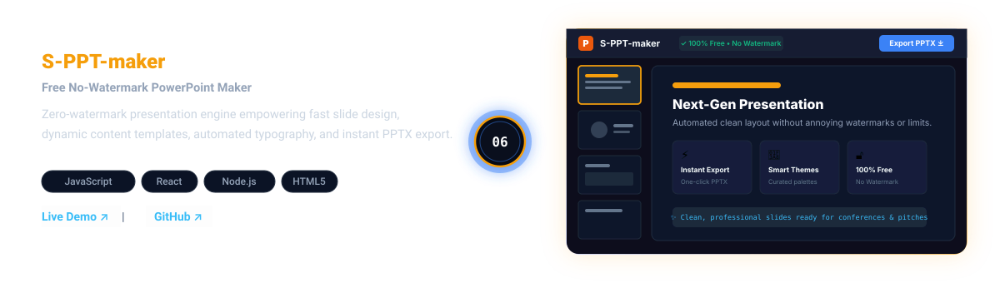
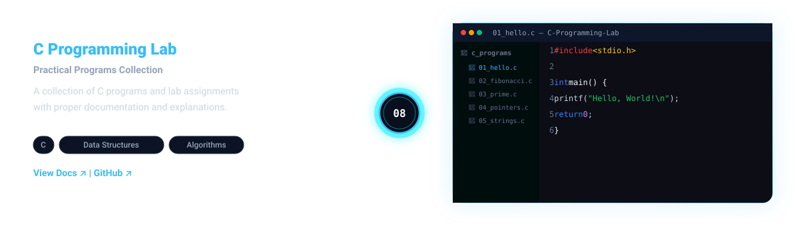
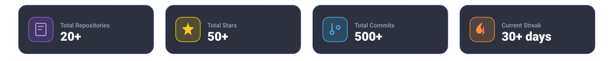

<!-- ════════════════════════════════════════════════════════════════
     1. TOP NAVIGATION / TERMINAL BAR
     ════════════════════════════════════════════════════════════════ -->

  

<!-- ════════════════════════════════════════════════════════════════
     2. HERO SECTION
     ════════════════════════════════════════════════════════════════ -->

  

<!-- ════════════════════════════════════════════════════════════════
     3. ABOUT ME SECTION
     ════════════════════════════════════════════════════════════════ -->

  

<!-- ════════════════════════════════════════════════════════════════
     4. TECH STACK SECTION
     ════════════════════════════════════════════════════════════════ -->

  

<!-- ════════════════════════════════════════════════════════════════
     5. PROJECTS JOURNEY (CENTRAL ALTERNATING TIMELINE)
     ════════════════════════════════════════════════════════════════ -->

<!-- 01 Aether-OS: Screenshot LEFT | Timeline | Description RIGHT -->

<!-- 02 Callbuddy-AI: Description LEFT | Timeline | Screenshot RIGHT -->

<!-- 03 Mochi: Screenshot LEFT | Timeline | Description RIGHT -->

<!-- 04 VN-media: Description LEFT | Timeline | Screenshot RIGHT -->

<!-- 05 S-PPT-maker: Screenshot LEFT | Timeline | Description RIGHT -->

<!-- 06 pirate-civ: Description LEFT | Timeline | Screenshot RIGHT -->

<!-- 07 Rishi-cosmic-protfolio: Screenshot LEFT | Timeline | Description RIGHT -->

<!-- 08 The-Four-Pillars: Description LEFT | Timeline | Screenshot RIGHT -->

  

<!-- ════════════════════════════════════════════════════════════════
     6. GITHUB STATS SECTION
     ════════════════════════════════════════════════════════════════ -->

  

<!-- ════════════════════════════════════════════════════════════════
     7. FOOTER SECTION
     ════════════════════════════════════════════════════════════════ -->

